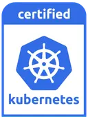

  

<h1>Avisi Cloud</h1>

  <strong>Cloud engineering for mission-critical software, AI and digital autonomy.</strong>

  We help organisations make clear cloud choices and build dependable
  environments with control over data, security, costs and continuity.

  <a href="https://www.avisi.nl/cloud"><strong>Cloud Services</strong></a> ·
  <a href="https://avisi.cloud/"><strong>AME Platform</strong></a> ·
  <a href="https://docs.avisi.cloud/"><strong>Documentation</strong></a> ·
  <a href="https://docs.avisi.cloud/blog"><strong>Engineering Blog</strong></a> ·
  <a href="https://status.avisi.cloud/"><strong>Status</strong></a>

---

## About Avisi Cloud

Avisi is a software engineering company from the Netherlands. For more than two
decades, we have helped organisations get more value from their software and
data. Avisi Cloud brings that engineering background to cloud strategy,
architecture, platform operations and observability.

We believe critical software and data systems should remain secure, available
and understandable. That requires more than selecting a cloud provider. It
requires deliberate architecture, clear ownership, operational visibility and
the freedom to choose infrastructure that fits the organisation.

Our approach is **cloud agnostic, engineering-led and close to our customers**.
We work across Dutch, European, public, private and hybrid cloud environments,
starting with the application, data, teams and risks rather than a preferred
vendor.

## How we help

| Area                                | What we provide                                                                                                     |
| ----------------------------------- | ------------------------------------------------------------------------------------------------------------------- |
| **Cloud strategy and architecture** | Cloud choices translated into an executable architecture based on applications, data, teams, costs and risk.        |
| **Digital sovereignty**             | Practical control over data location, access, legal context and strategic supplier dependencies.                    |
| **Managed environments**            | Secure, scalable and maintainable environments for business-critical applications.                                  |
| **Observability**                   | Strategy, architecture, tooling and operational practices across metrics, logs and traces.                          |
| **DevOps and platform engineering** | Automation and delivery practices that improve reliability without adding unnecessary complexity.                   |
| **Secure AI environments (ALPHA)**  | Controlled environments in which teams can experiment with AI without exposing production systems or customer data. |

  <a href="https://www.avisi.nl/cloud"><strong>Explore Avisi Cloud services →</strong></a>
  &nbsp;&nbsp;
  <a href="https://www.avisi.nl/observability"><strong>Explore Observability →</strong></a>
  &nbsp;&nbsp;
  <a href="https://www.avisi.nl/devops"><strong>Explore DevOps →</strong></a>

## Our engineering journey

Our managed platform grew from practical experience operating Kubernetes for
customers.

In **2018**, Kubernetes became our preferred platform for orchestrating
container deployments. Many of the environments we operated were private
clouds, where we provisioned and maintained Kubernetes using Ansible. As the
number of customers and clusters increased across private and public clouds, so
did the effort required to keep versions, components and operational tooling
consistent.

We needed a better way to manage environments, clusters and their supporting
tooling. The solution had to reduce repetitive engineering work, make upgrades
predictable and prevent configuration differences from becoming operational
incidents. When existing products did not match those requirements, we began
building our own platform in **2019**.

The first production version launched in **June 2020**. It provided a consistent
way to operate Kubernetes across multiple organisations and cloud environments.
The platform went on to manage hundreds of clusters across public and private
clouds while its lifecycle automation, security maintenance and operational
tooling continued to mature.

### From platform to Avisi Managed Environments

| Period        | Evolution                                                                                                                                                                                                                                                           |
| ------------- | ------------------------------------------------------------------------------------------------------------------------------------------------------------------------------------------------------------------------------------------------------------------- |
| **2021–2023** | Security maintenance, [GitOps workflows](https://docs.avisi.cloud/blog/workshop-ame-gitops), [multi-cloud upgrades](https://docs.avisi.cloud/blog/safely-upgrading-your-kubernetes-clusters) and integrated observability became established parts of the platform. |
| **2024**      | The [Avisi Cloud Terraform provider](https://docs.avisi.cloud/blog/announcing-our-terraform-provider) expanded infrastructure-as-code support.                                                                                                                      |
| **2025**      | Cluster lifecycle operations continued to mature, including a [new default node-pool upgrade strategy](https://docs.avisi.cloud/blog/node-pool-upgrade-strategy-default-changed).                                                                                   |
| **2026**      | AME added [Kubernetes 1.35 support](https://docs.avisi.cloud/blog/avisi-cloud-kubernetes-support-for-v1-35), strengthened account security with required MFA and continued its release and security cadence.                                                        |

The [engineering blog](https://docs.avisi.cloud/blog) records notable changes
and engineering guidance. The
[AME release notes](https://docs.avisi.cloud/docs/product/overview/release-notes)
remain the source of truth for current versions, component updates, security
notices, known issues and deprecations.

## Avisi Managed Environments

  

**Avisi Managed Environments (AME)** is our managed cloud platform for
business-critical software. Its managed Kubernetes foundation combines
automated lifecycle operations, infrastructure choice and integrated
observability in a consistent operating model.

AME is one part of Avisi Cloud's wider work. Where AME provides a managed
platform, our broader cloud practice also helps with strategy, architecture,
digital sovereignty, observability, DevOps and controlled AI environments.

  <a href="https://github.com/avisi-cloud/.github#readme"><strong>Read the technical AME overview →</strong></a>
  &nbsp;&nbsp;
  <a href="https://avisi.cloud/features"><strong>Explore AME features →</strong></a>
  &nbsp;&nbsp;
  <a href="https://console.avisi.cloud/"><strong>Start a trial →</strong></a>

### Managed Observability within AME

AME includes managed metrics, logging, dashboards and alerting based on
Prometheus, Cortex, Loki, Grafana and Alertmanager. This integrated product
capability is distinct from Avisi's broader full-stack observability services,
which also cover strategy, vendor-neutral tooling advice, implementation,
governance and adoption.

[Read the AME Observability documentation](https://docs.avisi.cloud/docs/product/overview/observability)

### Kubernetes certified

Avisi Cloud provides CNCF-conformant Kubernetes and is a Kubernetes Certified
Service Provider.

  

## Open-source engineering

Our public repositories include AME integrations, operational tooling and
software architecture projects:

| Project                                                                                 | Purpose                                                          |
| --------------------------------------------------------------------------------------- | ---------------------------------------------------------------- |
| [`acloud-toolkit`](https://github.com/avisi-cloud/acloud-toolkit)                       | Automates common and repetitive Kubernetes operational tasks.    |
| [`terraform-provider-acloud`](https://github.com/avisi-cloud/terraform-provider-acloud) | Provisions and manages AME resources with Terraform.             |
| [`go-client`](https://github.com/avisi-cloud/go-client)                                 | Go client for the Avisi Cloud API.                               |
| [`homebrew-tools`](https://github.com/avisi-cloud/homebrew-tools)                       | Distributes Avisi Cloud command-line tooling through Homebrew.   |
| [`structurizr-site-generatr`](https://github.com/avisi-cloud/structurizr-site-generatr) | Generates static architecture sites from Structurizr DSL models. |

[View all Avisi Cloud repositories](https://github.com/avisi-cloud?tab=repositories)

## Resources

| Resource              | Link                                                                          |
| --------------------- | ----------------------------------------------------------------------------- |
| Avisi Cloud services  | [www.avisi.nl/cloud](https://www.avisi.nl/cloud)                              |
| AME platform          | [avisi.cloud](https://avisi.cloud/)                                           |
| AME documentation     | [docs.avisi.cloud](https://docs.avisi.cloud/)                                 |
| Engineering updates   | [Engineering Blog](https://docs.avisi.cloud/blog)                             |
| AME release lifecycle | [Release Notes](https://docs.avisi.cloud/docs/product/overview/release-notes) |
| Service health        | [Avisi Cloud Status](https://status.avisi.cloud/)                             |
| Product support       | [support@avisi.cloud](mailto:support@avisi.cloud)                             |

---

  Part of <a href="https://www.avisi.nl/">Avisi Group B.V.</a> 
  © 2026 Avisi Cloud · Last updated July 2026

