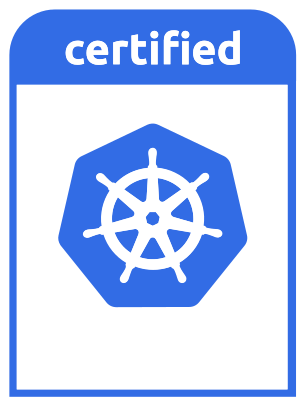

  

<h1 align="center">Cloud-native infrastructure for mission-critical software</h1>

  Built and operated by software and cloud engineers in the Netherlands.

  <a href="https://avisi.cloud/"><strong>Website</strong></a> ·
  <a href="https://avisi.cloud/features"><strong>AME Features</strong></a> ·
  <a href="https://docs.avisi.cloud/"><strong>Documentation</strong></a> ·
  <a href="https://docs.avisi.cloud/blog"><strong>Engineering Blog</strong></a> ·
  <a href="https://console.avisi.cloud/"><strong>Console</strong></a> ·
  <a href="https://status.avisi.cloud/"><strong>Status</strong></a>

---

## Engineering dependable cloud platforms

Avisi Cloud helps engineering teams run critical applications without carrying
the full operational burden of Kubernetes. We combine software engineering,
cloud-native infrastructure and day-2 operations in **Avisi Managed
Environments (AME)**.

| Capability | What it provides |
| --- | --- |
| **Managed Kubernetes** | CNCF-conformant Kubernetes with automated provisioning, upgrades and operational tooling. |
| **Managed Observability** | Metrics, logs, dashboards and alerting integrated into every AME Kubernetes environment. |
| **Multi-cloud operations** | One consistent operating model across supported public, private and hybrid infrastructure. |
| **Developer automation** | Console, CLI, API, Go client and Terraform workflows for repeatable platform operations. |

## Avisi Managed Environments

  

AME is our managed Kubernetes platform for running applications safely and
reliably in production. It provides a consistent experience across supported
cloud providers while Avisi Cloud operates the Kubernetes control plane,
platform components, upgrades and managed add-ons.

Teams retain Kubernetes access and portability while reducing repetitive
maintenance work. Platform engineers can use organisations, environments,
upgrade channels and automation to operate multiple clusters consistently.

  <a href="https://avisi.cloud/features"><strong>Explore AME features →</strong></a>
  &nbsp;&nbsp;
  <a href="https://docs.avisi.cloud/docs/product/overview/introduction"><strong>Read the product documentation →</strong></a>

## Observability is part of AME

Managed Observability is included within AME rather than offered as a separate
product. The integrated stack uses open, portable technology:

| Signal or workflow | Managed capability |
| --- | --- |
| Metrics | Prometheus collection with highly available long-term storage |
| Logs | Collection and storage with Loki |
| Dashboards | Visualization through Grafana |
| Alerts | Alertmanager routing to external services and webhooks |
| Audit | Cluster and platform activity for operational visibility |

[Explore AME Observability](https://docs.avisi.cloud/docs/product/overview/observability)

## Designed for enterprise operations

- **Consistent Kubernetes lifecycle:** defined release channels, managed
  components and repeatable upgrade workflows.
- **Identity and access controls:** organisations, OpenID Connect (OIDC),
  role-based access and audit logging.
- **Infrastructure choice:** support for multiple public clouds and private
  infrastructure without changing the Kubernetes operating model.
- **Operational visibility:** integrated metrics, logging, alerting, events and
  runbooks.
- **Cloud-native compatibility:** Kubernetes conformance backed by
  [Kubernetes Certified Service Provider expertise](https://docs.avisi.cloud/docs/product).

  

## Our journey

| Year | Milestone |
| --- | --- |
| **2018** | We adopted Kubernetes as our preferred platform for orchestrating container workloads. |
| **2019** | We began building our own platform to make multi-cloud Kubernetes operations repeatable and maintainable. |
| **2020** | The first production version of the platform launched in June. |
| **2021–2023** | AME matured through continuous security maintenance, [GitOps workflows](https://docs.avisi.cloud/blog/workshop-ame-gitops), [safer multi-cloud upgrades](https://docs.avisi.cloud/blog/safely-upgrading-your-kubernetes-clusters) and integrated observability. |
| **2024** | We [released the Avisi Cloud Terraform provider](https://docs.avisi.cloud/blog/announcing-our-terraform-provider) and continued tracking upstream Kubernetes releases. |
| **2025** | We improved cluster lifecycle operations, including a [new default node-pool upgrade strategy](https://docs.avisi.cloud/blog/node-pool-upgrade-strategy-default-changed) and support for successive Kubernetes releases. |
| **2026** | We [added Kubernetes 1.35 support](https://docs.avisi.cloud/blog/avisi-cloud-kubernetes-support-for-v1-35), strengthened account security with required MFA and continued platform security updates. |

The [engineering blog](https://docs.avisi.cloud/blog) records product and
engineering milestones. The
[AME release notes](https://docs.avisi.cloud/docs/product/overview/release-notes)
are the source of truth for current versions, component updates, security
notices, known issues and deprecations.

<strong>Why we built AME</strong>

As the number of Kubernetes clusters we operated grew across private and public
clouds, manual maintenance became increasingly expensive and inconsistent. We
needed a repeatable way to manage environments, cluster versions and operational
tooling without making every engineering team solve the same problems.

AME grew from that need: a multi-tenant platform with a maintained Kubernetes
distribution, automated lifecycle operations and integrated observability.
Testing consistent combinations of Kubernetes components and add-ons before
rollout makes upgrades more predictable across environments.

## Recent engineering updates

- **May 2026:** [MFA required for all users](https://docs.avisi.cloud/blog/mfa-required-for-all-users)
  strengthens access to the Avisi Cloud platform.
- **April 2026:** [Kubernetes 1.35 support](https://docs.avisi.cloud/blog/avisi-cloud-kubernetes-support-for-v1-35)
  continued AME's upstream Kubernetes lifecycle.
- **February 2025:** [The default node-pool upgrade strategy changed](https://docs.avisi.cloud/blog/node-pool-upgrade-strategy-default-changed)
  to improve the stability of patch upgrades.

[Browse all engineering updates](https://docs.avisi.cloud/blog)

## Open-source engineering

Selected projects maintained by the Avisi Cloud engineering team:

| Project | Purpose |
| --- | --- |
| [`acloud-toolkit`](https://github.com/avisi-cloud/acloud-toolkit) | Automates common and repetitive Kubernetes operational tasks. |
| [`terraform-provider-acloud`](https://github.com/avisi-cloud/terraform-provider-acloud) | Provisions and manages AME resources with Terraform. |
| [`go-client`](https://github.com/avisi-cloud/go-client) | Go client for the Avisi Cloud API. |
| [`homebrew-tools`](https://github.com/avisi-cloud/homebrew-tools) | Distributes released Avisi Cloud command-line tooling through Homebrew. |
| [`structurizr-site-generatr`](https://github.com/avisi-cloud/structurizr-site-generatr) | Generates static architecture sites from Structurizr DSL models. |

[View all Avisi Cloud repositories](https://github.com/avisi-cloud?tab=repositories)

## Resources

| Resource | Link |
| --- | --- |
| Start a trial | [Open the AME Console](https://console.avisi.cloud/) |
| Product documentation | [docs.avisi.cloud](https://docs.avisi.cloud/) |
| Platform features | [AME feature overview](https://avisi.cloud/features) |
| Product updates | [Engineering Blog](https://docs.avisi.cloud/blog) |
| Release lifecycle | [AME release notes](https://docs.avisi.cloud/docs/product/overview/release-notes) |
| Service health | [Avisi Cloud Status](https://status.avisi.cloud/) |
| Support | [support@avisi.cloud](mailto:support@avisi.cloud) |

---

  Part of <a href="https://www.avisi.nl/cloud">Avisi Group B.V.</a> 
  © 2026 Avisi Cloud · Last updated July 2026

